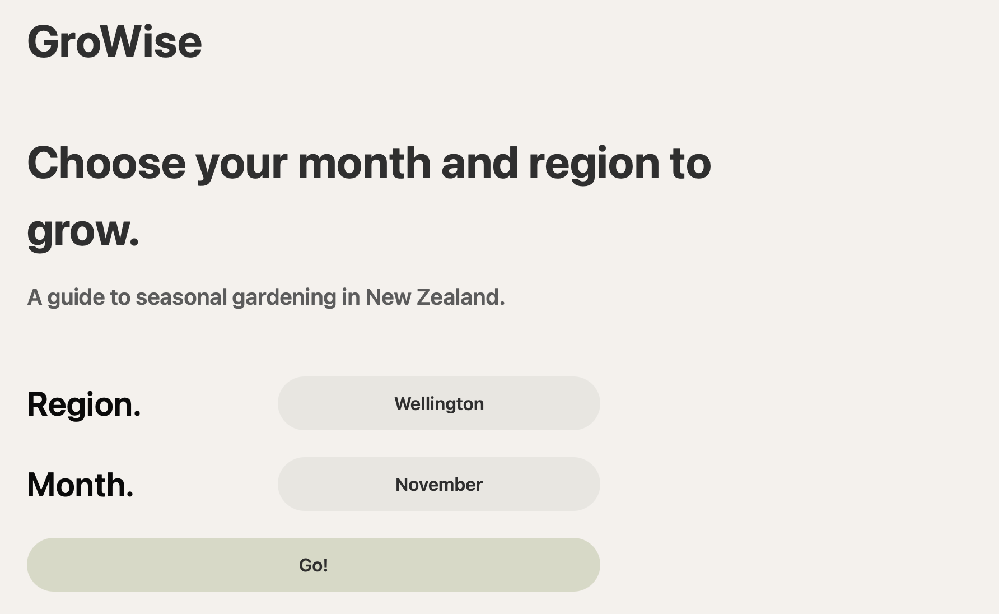
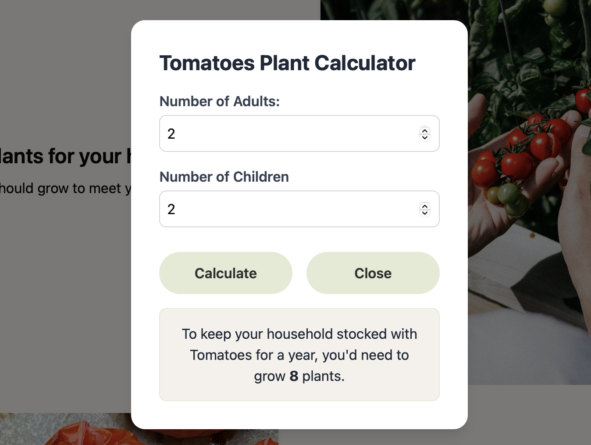
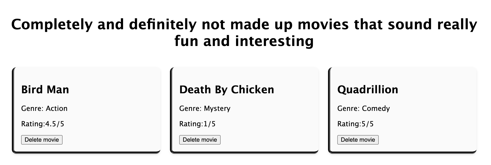

# Kia ora, I'm Rebecca  👋

## About Me

I’m a Full Stack Software Developer who enjoys using creativity and ingenuity to solve problems. I recently completed a year long, part time web development bootcamp with Dev Academy. During this course I gained 800+ hours of experience in modern development languages such as React, TypeScript, JavaScript, Express and SQLite with Knex.

I’ve worked in the Information Technology industry for five years, primarily in the IT Help Desk space. At the beginning of 2025 I began working on  back end configuration of Service Now, becoming my organisation's Service Now expert. My background in IT support has given me a strong foundation in troubleshooting, clear communication and working closely with end users to understand their needs.

My biggest motivation for learning software development has stemmed from the desire to build something creative and meaningful. I’ve always been creative, whether it’s writing blogs about recent travels or coming up with new app ideas, learning software development has given me the tools to turn my ideas into reality.

I’m actively seeking full stack software development opportunities. If you’re looking for a motivated, customer focused developer with a strong technical background, I’d love to connect.

## Projects

### 🪴 GroWise 

For our final group project of bootcamp, I was placed into a team of five to plan, develop and present a full stack project. My group developed a web based application called GroWise. 

GroWise takes the end-users region and chosen month and outputs which plants to plant in their garden. The stack we focused on was TypeScript, JavaScript, SQLite (knex), Express and Shadcn for styling. 

Once most of the planning was complete, I spent time creating the database migrations and entering seed information. With the database information available to use I created the Plant Guide page component, this is the component that pulls different information from various tables and elegantly displays it in an easy to read way. 

One thing I am particularly proud of from this project is the calculator modal I created. The calculator allows the end user to enter the number of adults and children in their household and calculator will calculate the amount of plants the user will need to plant to feed their family for a year (based on average consumption in New Zealand).

### 🎬 Movie Collection 
Movie collection is an individual full stack project that I worked on during my studies. I really enjoyed this project as it was the first time I had done the work from start to finish or writing both the back and front end. Working on the project this way solidified my thought process about how everything fits together. 

To improve this project, I could add information from the Movie Database API or add the ability to log and rate real movies, rather than made up titles. 

### 📖 Rebecca Ingulkar Foundations Blog

During the first 10 weeks of my study I kept a blog to practice, write and reflect on what I was learning. 

I kept the layout clean and easy to navigate. I added features that were recommended to me during feedback from one of the course facilitators. 

At the time, I really enjoyed working on this project because we were working with the basics, HTML, CSS and JavaScript and it was a great chance to experiment with what I already knew and the new learnings I was learning. 

## Tech Stack
 

## Currently Working On
- Adding different plants to our forever expanding plants database on GroWise.
- Fixing minor bugs on GroWise.

## 📫 Let's Connect
- [LinkedIn](www.linkedin.com/in/rebeccaingulkar)
- [Email me](mailto:rebeccaingulkar@outlook.com)
## Fun Fact
I enjoy spending time in my garden, cooking or baking my favourite recipes and doing HIIT classes at the gym.  

